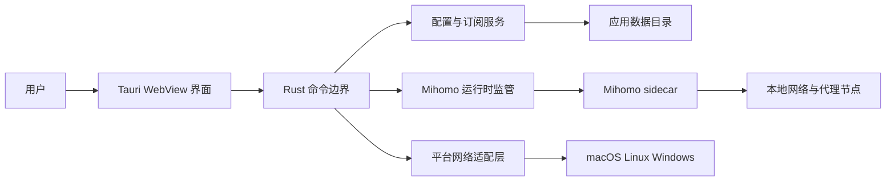
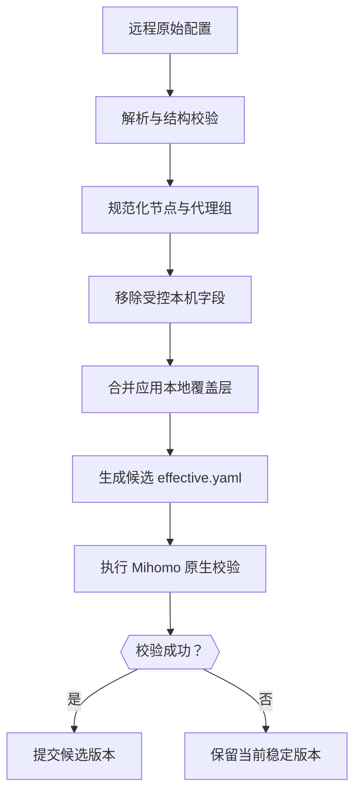
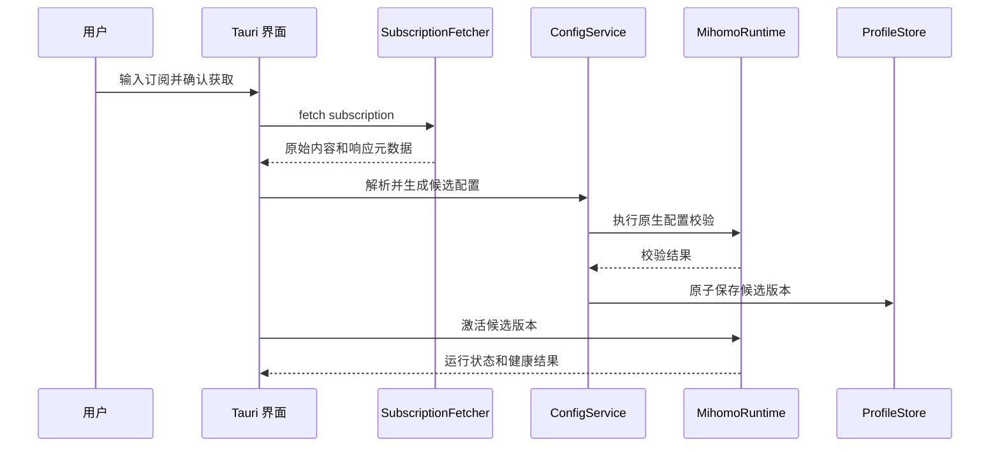
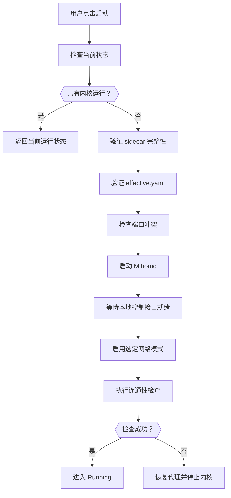
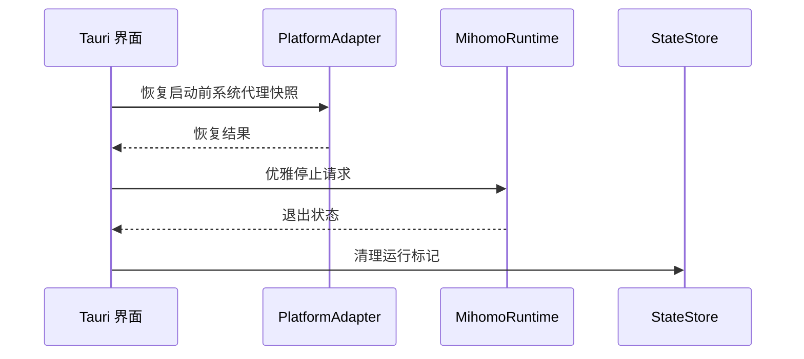
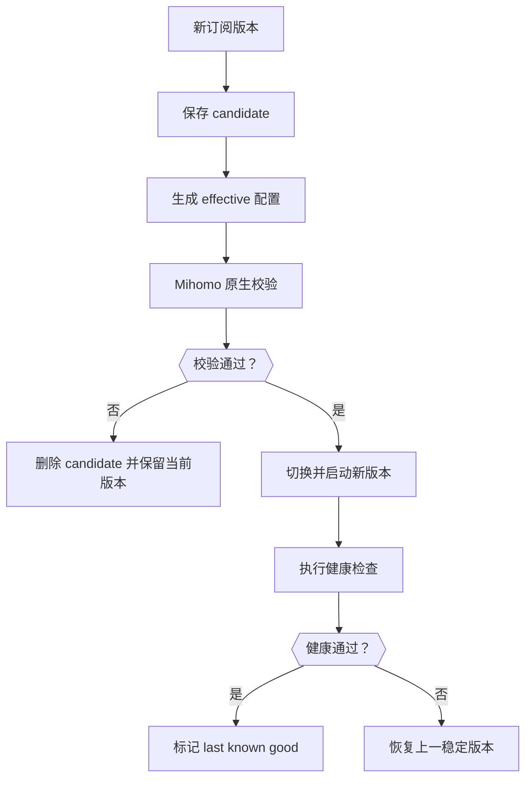
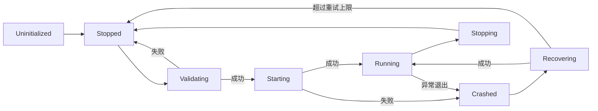
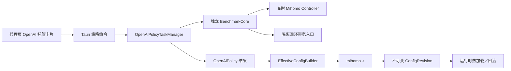
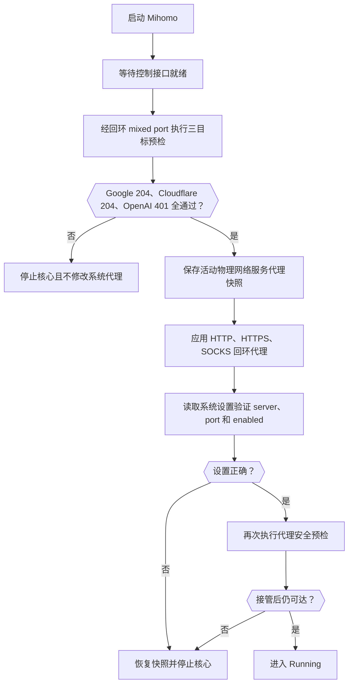

# RouteDeck 软件设计说明书（SDD）

[[index|返回文档索引]]

关联状态文档：[[架构与里程碑|架构与里程碑]]

> 文档类型：Software Design Description  
> 文档版本：1.0-draft  
> 品牌与构建基线：RouteDeck 0.6.0（尚未发布）\
> 更新时间：2026-09-04\
> 目标平台：macOS、Linux、Windows  
> 技术栈：Rust、Tauri 2、TypeScript、Vite、Mihomo  
> 规范状态：设计基线草案，供后续实现、测试和验收使用

## v0.7.11 当前实现补充

系统代理的本地启用与外网健康检查按 [启动提速与友好提示](启动提速与友好提示.md) 分离；该说明更新本文较早的“外网预检成功后才能启用系统代理”流程，其余模式和权限边界保持。

## 0. 文档约定

本文将 SDD 定义为“软件设计说明书”。文档同时描述当前实现和目标设计，所有结论使用以下状态标签：

| 标签 | 含义 |
|---|---|
| `[已实现]` | 已在当前代码中确认，并完成至少一种本地验证 |
| `[部分实现]` | 存在代码骨架，但尚未形成完整用户闭环 |
| `[未实现]` | 当前代码中不存在，作为后续实施项 |
| `[目标设计]` | 本文规定的后续正式实现要求 |
| `[待验证]` | 已确定方向，但需要对应平台、真实订阅或网络环境验证 |

文档中的“必须”“应”“可以”分别表示：

- **必须**：发布门槛，不满足时不得宣称对应功能完成。
- **应**：默认工程要求，偏离时需要记录设计决策。
- **可以**：增强能力，不阻塞当前阶段发布。

---

## 1. 文档目的

本文件是 RouteDeck（原 mihomo-codex）的单一软件设计规范源，用于统一：

1. 产品边界和用户目标。
2. 功能需求与非功能需求。
3. Rust、Tauri WebView、Mihomo sidecar 和操作系统之间的职责边界。
4. Clash Meta／Mihomo 配置的获取、解析、规范化、校验、落盘、激活和回滚流程。
5. macOS、Linux、Windows 的系统代理与 TUN 接管策略。
6. 安全、隐私、性能、可靠性和可观测性要求。
7. 测试矩阵、发布流程和验收标准。

本文面向：产品负责人、架构师、Rust 开发者、前端开发者、测试人员和发布维护者。

---

## 2. 背景与第一性原理

### 2.1 表面需求

开发一个轻量、稳定、可在 macOS、Linux 和 Windows 使用的代理客户端，优先兼容 Clash Meta／Mihomo YAML 订阅。

### 2.2 根本问题

用户真正需要的不是“支持最多协议的 GUI”，而是一个可预测的网络控制闭环：

```text
可靠获取配置
→ 准确解释配置
→ 安全生成最终生效配置
→ 稳定监管 Mihomo 内核
→ 明确接管系统流量
→ 在失败时恢复原状态
→ 给出可理解的诊断结果
```

### 2.3 核心设计原则

1. **配置源与最终生效配置分离**：远程订阅是输入，不直接拥有本机控制权。
2. **流量接管与规则决策分离**：系统代理或 TUN 负责捕获流量，Mihomo 规则负责决定 DIRECT 或代理出口。
3. **稳定优先于功能数量**：第一版只开放经过测试的代理组、配置字段和运行模式。
4. **失败必须可回滚**：订阅更新、内核启动、系统代理设置任一失败，都必须恢复上一稳定状态。
5. **安全默认值由应用控制**：控制端口只绑定回环地址，TUN、脚本和远程控制默认关闭。
6. **平台差异封装在 Rust 适配层**：UI 不直接执行系统命令，也不直接管理 Mihomo 进程。
7. **诊断必须分层**：区分订阅、解析、DNS、规则、内核、节点、系统代理和 TUN 问题。

---

## 3. 产品范围

### 3.1 范围内

- macOS、Linux、Windows 桌面客户端。
- Clash Meta／Mihomo YAML 订阅 URL 和本地 YAML 文件。
- 配置解析、结构摘要、兼容性诊断和 Mihomo 原生校验。
- 多配置档案、订阅更新、版本记录和失败回滚。
- Mihomo sidecar 的发现、验证、启动、停止、崩溃检测和恢复。
- 本地 HTTP／SOCKS mixed port。
- 系统代理模式。
- 可选 TUN 模式。
- 代理组查看、节点选择、延迟测试和故障切换状态展示。
- DNS、规则、连接和日志诊断。
- 跨平台安装包、签名、升级和回滚。

### 3.2 第一版明确不做

- 自建代理服务器、节点销售、账号套餐和计费。
- 移动端 iOS／Android。
- HTTPS 解密、MITM 证书管理。
- URL Rewrite、远程脚本执行和任意插件系统。
- 局域网远程控制面板。
- 浏览器扩展。
- 订阅内容编辑器或完整规则 IDE。
- 自动绕过用户未明确启用的系统权限边界。

### 3.3 未来可选范围

- 单节点 URI 和二维码导入。
- sing-box JSON 导入转换。
- 规则可视化编辑。
- 多设备配置同步。
- 企业托管策略。

---

## 4. 用户角色与主要场景

| 角色 | 目标 | 核心关注点 |
|---|---|---|
| 普通用户 | 导入订阅并一键使用 | 简单、稳定、错误可理解 |
| 高级用户 | 查看节点、规则、DNS 和连接 | 可解释、可选择、可诊断 |
| 开发测试人员 | 验证配置和不同核心行为 | 原始配置、有效配置、分层日志 |
| 发布维护者 | 交付三平台安装包 | sidecar、签名、升级、回滚 |

### 4.1 关键用户旅程

#### 场景 A：首次使用

1. 启动应用。
2. 应用完成内核、自身版本和本地端口检查。
3. 用户输入 Clash Meta／Mihomo 订阅 URL。
4. 应用获取、解析并显示节点、代理组、规则和风险摘要。
5. 用户确认并激活配置。
6. 应用启动 Mihomo，开启系统代理或手动代理模式。
7. 应用执行连通性验证并显示实际出口状态。

#### 场景 B：订阅更新

1. 应用携带 ETag／Last-Modified 请求订阅。
2. 新内容写入候选版本。
3. 完成解析、应用策略合并和 Mihomo `-t` 校验。
4. 校验成功后原子切换。
5. 新内核状态验证失败时自动恢复上一稳定版本。

#### 场景 C：节点故障

1. 当前节点健康检查失败。
2. Mihomo 代理组按既定策略切换。
3. UI 显示切换前后节点、失败阶段和耗时。
4. 用户可以手动固定节点或恢复自动选择。

#### 场景 D：退出与异常恢复

1. 正常退出时停止内核并恢复原系统代理状态。
2. 应用崩溃或被强制结束后，下次启动检测残留状态。
3. 清理孤儿进程、恢复代理设置并给出恢复结果。

---

## 5. 质量目标与设计约束

### 5.1 质量属性优先级

| 优先级 | 属性 | 设计含义 |
|---:|---|---|
| 1 | 稳定性 | 配置、内核和系统代理变更必须具备回滚路径 |
| 2 | 安全性 | 订阅、控制接口、sidecar 和权限操作采用最小授权 |
| 3 | 可诊断性 | 所有失败映射到明确阶段和可行动建议 |
| 4 | 兼容性 | 优先兼容真实 Clash Meta／Mihomo YAML 订阅 |
| 5 | 轻量性 | 控制后台资源、依赖数量、启动时间和安装包体积 |
| 6 | 可维护性 | 核心、配置、平台适配和 UI 解耦 |

### 5.2 技术约束

- UI 使用 Tauri 2 系统 WebView。
- 应用层使用 Rust。
- 前端使用 TypeScript，当前为原生 DOM + Vite。
- 网络核心使用 Mihomo sidecar，不在 Rust 中重新实现代理协议。
- 目标平台为 macOS、Linux、Windows。
- 远程订阅不得直接决定本机控制端口、控制接口暴露范围和权限模式。
- 发布版不得依赖用户提前安装 Mihomo。

---

## 6. 功能需求

### 6.1 订阅与配置

| ID | 优先级 | 需求 | 验收摘要 |
|---|---|---|---|
| FR-CFG-001 | P0 | 支持 HTTPS 订阅 URL | 能获取并显示响应状态、大小和更新时间 |
| FR-CFG-002 | P0 | 支持本地 YAML 文件 | 导入后不修改原文件 |
| FR-CFG-003 | P0 | 支持 Clash Meta／Mihomo YAML | 解析节点、代理组、规则、DNS 和 provider |
| FR-CFG-004 | P0 | 保存原始配置和生效配置 | 两者可追踪且不可混淆 |
| FR-CFG-005 | P0 | Mihomo 原生配置校验 | `mihomo -t` 成功后才允许激活 |
| FR-CFG-006 | P0 | 配置版本化和回滚 | 至少保留当前版本和上一稳定版本 |
| FR-CFG-007 | P0 | 不支持字段可见 | 不得静默丢弃关键字段 |
| FR-CFG-008 | P1 | 条件请求更新 | 使用 ETag／Last-Modified，未变化时不重启 |
| FR-CFG-009 | P1 | 多档案管理 | 可新增、重命名、删除、切换和排序 |
| FR-CFG-010 | P2 | 单节点 URI／二维码 | 转换为内部标准节点模型 |

### 6.2 Mihomo 运行时

| ID | 优先级 | 需求 | 验收摘要 |
|---|---|---|---|
| FR-CORE-001 | P0 | 发布版内置 Mihomo sidecar | 用户无需额外安装核心 |
| FR-CORE-002 | P0 | 校验核心版本和完整性 | 版本、平台、架构和 SHA-256 匹配 |
| FR-CORE-003 | P0 | 启动和停止内核 | 状态机无重复启动和遗留进程 |
| FR-CORE-004 | P0 | 捕获退出状态 | 显示退出码和归一化错误类型 |
| FR-CORE-005 | P0 | 应用退出时清理 | 停止子进程并恢复系统设置 |
| FR-CORE-006 | P1 | 崩溃恢复 | 有限次数退避重启，持续失败进入 crashed |
| FR-CORE-007 | P1 | 内核版本升级 | 与应用版本绑定并支持回滚 |
| FR-CORE-008 | P1 | Mihomo API 集成 | 读取代理组、连接、规则、日志和流量状态 |

### 6.3 流量接管

| ID | 优先级 | 需求 | 验收摘要 |
|---|---|---|---|
| FR-NET-001 | P0 | 手动代理模式 | 显示本地 HTTP／SOCKS 地址和端口 |
| FR-NET-002 | P0 | 系统代理模式 | 启用和关闭时准确修改并恢复系统设置 |
| FR-NET-003 | P0 | 代理端口冲突检测 | 启动前发现冲突并显示占用端口 |
| FR-NET-004 | P1 | 网络切换恢复 | Wi-Fi、有线、休眠唤醒后恢复连接 |
| FR-NET-005 | P1 | 可选 TUN 模式 | 显式授权、路由回环保护、DNS 接管 |
| FR-NET-006 | P1 | IPv4／IPv6 | 分别显示可用性和实际出口 |
| FR-NET-007 | P1 | UDP／QUIC | 分别测试并显示能力 |

### 6.4 节点、代理组与规则

| ID | 优先级 | 需求 | 验收摘要 |
|---|---|---|---|
| FR-PROXY-001 | P0 | 展示节点和协议 | 名称、类型、地址脱敏、可用状态 |
| FR-PROXY-002 | P0 | 展示代理组 | 支持 select、url-test、fallback |
| FR-PROXY-003 | P0 | 手动选择节点 | 选择结果与 Mihomo API 一致 |
| FR-PROXY-004 | P1 | 延迟测试 | 展示测试目标、阶段、时间和错误 |
| FR-PROXY-005 | P1 | 规则查看 | 按顺序展示规则和目标策略组 |
| FR-PROXY-006 | P1 | 规则命中解释 | 输入域名／IP 后显示匹配路径 |

### 6.5 诊断与可观测性

| ID | 优先级 | 需求 | 验收摘要 |
|---|---|---|---|
| FR-DIAG-001 | P0 | 分层健康检查 | 配置、端口、内核、DNS、TCP、TLS、HTTP |
| FR-DIAG-002 | P0 | 脱敏日志 | URL Token、密码、UUID 和 secret 不出现在导出日志 |
| FR-DIAG-003 | P0 | 错误归一化 | 错误具备 code、stage、message、action |
| FR-DIAG-004 | P1 | 连接列表 | 展示目标、规则、代理链和流量 |
| FR-DIAG-005 | P1 | 诊断包导出 | 包含版本、平台、配置摘要和脱敏日志 |

---

## 7. 非功能需求

| ID | 类别 | 要求 |
|---|---|---|
| NFR-REL-001 | 可靠性 | 任意配置切换失败后恢复上一稳定配置和代理状态 |
| NFR-REL-002 | 可靠性 | 应用重启后可识别残留核心和系统代理状态 |
| NFR-REL-003 | 可靠性 | 进程监管不得遗留孤儿 Mihomo 进程 |
| NFR-SEC-001 | 安全 | 控制接口仅绑定 127.0.0.1 或 ::1，并使用随机 secret |
| NFR-SEC-002 | 安全 | sidecar 必须经过固定版本、来源和 SHA-256 校验 |
| NFR-SEC-003 | 安全 | Tauri capability 按窗口、平台和命令最小授权 |
| NFR-SEC-004 | 隐私 | 默认不采集遥测，不上传订阅、节点和连接信息 |
| NFR-PERF-001 | 性能 | 参考设备冷启动 P95 目标不超过 2 秒 |
| NFR-PERF-002 | 性能 | 空闲状态应用加核心总 CPU 五分钟均值目标低于 1% |
| NFR-PERF-003 | 性能 | 空闲 RSS 初始预算为 150 MiB，按平台实测收敛 |
| NFR-PERF-004 | 性能 | 4 MiB YAML 配置解析目标不超过 1 秒 |
| NFR-COMP-001 | 兼容 | macOS Apple Silicon／Intel、Windows x64／ARM64、Linux x64／ARM64 |
| NFR-MAINT-001 | 维护 | 核心、配置、平台适配、持久化和 UI 通过明确接口解耦 |
| NFR-TEST-001 | 测试 | P0 模块必须具备单元测试和集成测试 |
| NFR-UX-001 | 可用性 | 核心流程支持键盘操作、焦点可见和辅助技术语义 |
| NFR-I18N-001 | 国际化 | UI 文案与错误信息从业务逻辑分离，首发支持简体中文 |

性能数值为初始预算，必须通过真实设备基准验证后冻结。

### 7.1 当前依赖基线

| 组件 | 当前解析版本 | 作用 |
|---|---:|---|
| @tauri-apps/api | 2.11.1 | WebView 调用 Tauri API |
| @tauri-apps/cli | 2.11.4 | 开发与打包 |
| tauri Rust crate | 2.11.5 | 桌面运行时 |
| tauri-plugin-autostart | 2.5.1 | 登录启动 |
| tauri-plugin-single-instance | 2.4.3 | 单实例保护 |
| TypeScript | 5.6.3 | 前端类型检查 |
| Vite | 6.4.3 | 前端构建 |
| reqwest | 0.12.28 | Rust 侧订阅请求 |
| serde_yaml | 0.9.34+deprecated | 当前 YAML 解析，发布前需评估维护状态 |

### 7.2 当前应用基线

| 项目 | 当前值 |
|---|---|
| productName | RouteDeck |
| 仓库、npm／Cargo 包、主可执行文件 | routedeck |
| identifier | com.cmmuu.mihomodesktop |
| 源码版本 | 0.6.0（尚未发布） |
| 主窗口 | 1180 × 780 |
| 最小窗口 | 900 × 640 |
| Vite 开发端口 | 1420 |
| 各平台构建与安装验证 | 以对应版本发布说明及验证记录为准，不沿用旧版验收结论 |
| 最近已发布版本 | mihomo-codex 0.5.0；历史附件名不变 |
| 当前 bundle sidecar | `binaries/mihomo` |

RouteDeck 更名保留 `com.cmmuu.mihomodesktop` 及原应用数据目录、`mihomo-tun-helper` 二进制、`com.cmmuu.mihomodesktop.tun-helper` 服务／plist 标识，以及 `# mihomo-codex-rule:` 规则元数据格式。显示品牌与持久化／服务身份分离，避免仅因更名重置订阅、设置或规则导入兼容性。安装器、登录启动项和 helper 授权仍需按平台单独验收。

本文较早章节中的实现标注和测试事实保留原设计迭代语境；0.6.0 的品牌基线更新不代表重新验收这些功能。当前版本状态请同时参照 [[架构与里程碑|架构与里程碑]] 和对应发布说明。

---

## 8. 总体架构

### 8.1 系统上下文



### 8.2 分层职责

| 层 | 职责 | 禁止事项 |
|---|---|---|
| WebView UI | 展示、输入、用户确认、调用命令 | 直接执行 shell、直接访问 Mihomo secret |
| Tauri 命令层 | 参数校验、授权、DTO 转换、错误映射 | 包含大量业务状态 |
| 应用服务层 | 订阅、配置、档案、诊断流程编排 | 依赖具体 UI DOM |
| 运行时监管层 | sidecar、状态机、日志、退出和恢复 | 修改远程订阅内容 |
| 平台适配层 | 系统代理、权限、启动项、网络事件 | 把平台命令暴露给前端 |
| Mihomo 核心 | 协议、DNS、规则、代理组、连接 | 直接控制应用档案数据库 |

### 8.3 目标目录结构

```text
src/
  app/
  components/
  features/
    dashboard/
    profiles/
    proxies/
    rules/
    diagnostics/
  services/
  types/

src-tauri/src/
  commands/
  application/
  config/
  subscription/
  runtime/
  mihomo_api/
  platform/
    macos/
    windows/
    linux/
  storage/
  security/
  diagnostics/
  error.rs
  lib.rs

src-tauri/binaries/
  mihomo-<target-triple>

docs/
  软件设计说明书.md
  架构与里程碑.md
```

---

## 9. 核心组件设计

### 9.1 SubscriptionFetcher

**职责**：安全获取订阅内容和响应元数据。

当前实现：

- `[已实现]` HTTP／HTTPS URL 解析。
- `[已实现]` 默认 User-Agent 为 `clash.meta`。
- `[已实现]` 请求超时 20 秒。
- `[已实现]` 最多跟随 5 次重定向。
- `[已实现]` 响应体上限 4 MiB。
- `[已实现]` 返回 Content-Type、ETag、Last-Modified。

目标设计：

- 限制协议为 HTTPS；HTTP 仅在显式本地开发开关下使用。
- 重定向后重新执行协议和目标地址检查。
- 默认阻止回环、链路本地和云元数据地址；本地订阅需显式开启。
- 使用条件请求减少重复下载。
- 只在内存中返回原始内容，不在日志记录完整 URL。
- 对超时、TLS、DNS、HTTP 状态、体积和编码错误分别编码。

### 9.2 ProfileParser

**职责**：解析远程配置并形成结构化摘要。

当前实现：

- `[已实现]` 使用 YAML Value 解析根对象。
- `[已实现]` 统计 proxies、proxy-groups、proxy-providers、rules、rule-providers。
- `[已实现]` 识别节点协议和代理组类型。
- `[已实现]` 第一版 UI 重点支持 select、url-test、fallback。
- `[已实现]` 提示 script、external-controller 和缺失字段。

目标设计：

- 解析结果区分 error、warning、info。
- 节点具有稳定内部 ID，不使用名称作为唯一键。
- 保留未知字段供 Mihomo 原生验证，但在 UI 中显式标记。
- 不把 YAML 解析成功等同于 Mihomo 可运行。
- 在 1.0 前评估替换已停止维护的 `serde_yaml 0.9`。

### 9.3 EffectiveConfigBuilder

**职责**：从远程配置和本机策略生成最终生效配置。

这是目标架构中的关键安全边界。



应用必须拥有以下字段的最终控制权：

- mixed-port、socks-port、port。
- external-controller、secret、external-controller-cors。
- allow-lan、bind-address。
- tun.enable、tun.auto-route、tun.auto-detect-interface。
- 日志输出目录和级别上限。
- 配置、provider 和缓存文件路径。

### 9.4 ProfileStore

**职责**：保存档案、订阅元数据、版本和激活状态。

当前实现：

- `[已实现]` 使用 Tauri app_data_dir 下的 `profiles` 目录。
- `[已实现]` 文件名只允许 ASCII 字母、数字、连字符和下划线，最长 64 字符。
- `[已实现]` Unix 平台保存后设置 `0600`。
- `[部分实现]` 可保存和读取单个 YAML 文件。

目标设计：

- 使用 UUID 作为目录和实体主键，显示名称单独保存，支持中文名称。
- 每次更新创建不可变版本目录。
- 原子写入临时文件后 rename。
- 维护 active、candidate、last-known-good 三个指针。
- Windows 使用受当前用户保护的目录和 ACL。
- 订阅 Token 和 Mihomo secret 存入操作系统安全存储。

### 9.5 MihomoRuntimeSupervisor

**职责**：监管 sidecar 生命周期。

当前实现：

- `[已实现]` 依次查找 MIHOMO_BIN、应用可执行目录和 PATH。
- `[已实现]` 使用 `mihomo -v` 探测版本。
- `[已实现]` 使用 `mihomo -t -d DATA_DIR -f CONFIG` 校验。
- `[已实现]` 启动和 kill／wait 停止。
- `[已实现]` 使用 Mutex 保存 Child、二进制路径和配置路径。
- `[部分实现]` 通过 try_wait 判断 running／stopped。
- `[未实现]` 发布版 sidecar 打包、日志、优雅停止、崩溃恢复。

目标设计：

- 使用明确状态机而非布尔值。
- 缓存版本信息，避免每次状态刷新执行 `-v`。
- 捕获 stdout／stderr 到有界缓冲并实时脱敏。
- 优先通过 Mihomo API 请求优雅关闭，再执行超时 kill。
- macOS／Linux 使用进程组，Windows 使用 Job Object，确保父进程退出后清理子进程。
- 内核异常退出采用有限重试和指数退避。
- 应用退出钩子恢复系统代理后再结束 sidecar。

### 9.6 MihomoApiClient

**职责**：通过仅本机可访问的控制接口读取和修改运行状态。

目标要求：

- external-controller 固定绑定 `127.0.0.1:PORT` 或 `[::1]:PORT`。
- 每次安装生成随机 secret，并存入安全存储。
- WebView 不直接持有 secret；所有请求由 Rust 代理。
- API 客户端设置连接、请求和 WebSocket 心跳超时。
- 支持代理组、节点选择、延迟测试、连接、规则、日志和流量接口。

### 9.7 PlatformAdapter

**职责**：封装三平台系统代理、权限、启动项和网络状态事件。

统一接口建议：

```rust
trait PlatformNetworkAdapter {
    fn capture_current_proxy_state(&self) -> Result<ProxySnapshot, AppError>;
    fn enable_system_proxy(&self, endpoint: LocalProxyEndpoint) -> Result<(), AppError>;
    fn restore_proxy_state(&self, snapshot: &ProxySnapshot) -> Result<(), AppError>;
    fn request_tun_permission(&self) -> Result<PermissionState, AppError>;
    fn subscribe_network_changes(&self) -> Result<NetworkEventStream, AppError>;
}
```

平台实现不得向前端暴露任意命令执行能力。

### 9.8 DiagnosticsService

**职责**：聚合配置、核心、端口、DNS、网络和出口测试。

诊断阶段：

1. 订阅获取。
2. YAML 解析。
3. 应用策略校验。
4. Mihomo 原生校验。
5. 本地端口监听。
6. DNS 解析。
7. TCP 连接。
8. TLS 握手。
9. HTTP 首字节。
10. UDP／QUIC 可用性。
11. 规则命中和实际代理链。

### 9.9 UI 信息架构

| 页面 | P0 内容 | 后续内容 |
|---|---|---|
| 概览 | 运行状态、当前档案、网络模式、上传下载、快速启停 | 出口 IP、健康趋势 |
| 配置 | 订阅列表、刷新、校验、版本、激活和回滚 | 单节点 URI、编辑器 |
| 代理 | 代理组、节点选择、延迟和可用性 | 多目标质量评分 |
| 规则 | 规则列表、搜索、命中目标 | 规则模拟器 |
| 连接 | 当前连接、目标、规则、代理链、流量 | 连接关闭和聚合 |
| 日志 | 内核与应用日志、级别过滤、脱敏导出 | 结构化查询 |
| 诊断 | 分层检查、错误阶段、行动建议 | 自动诊断包 |
| 设置 | 启动项、语言、主题、端口、更新、网络模式 | 企业策略 |
| 关于 | 应用版本、Mihomo 版本、许可证和校验值 | 更新通道 |

### 9.10 UI 状态规范

- 所有异步动作必须具有 idle、loading、success、error 状态。
- 破坏性或全局网络动作必须显示影响范围。
- “核心运行”与“系统流量已接管”使用不同状态标识。
- 节点“可连接”与“目标业务可用”使用不同指标。
- 订阅、节点、控制 secret 在 UI 中默认脱敏。
- 错误信息优先展示用户可执行动作，技术细节通过 detailId 展开。
- 页面刷新不得隐式启动、停止或切换代理节点。

---

## 10. 数据模型

### 10.1 ProfileRecord

```rust
struct ProfileRecord {
    id: Uuid,
    display_name: String,
    source: ProfileSource,
    active_revision_id: Option<Uuid>,
    last_known_good_revision_id: Option<Uuid>,
    created_at: DateTime,
    updated_at: DateTime,
}
```

### 10.2 ProfileSource

```rust
enum ProfileSource {
    RemoteSubscription {
        url_secret_ref: SecretRef,
        user_agent: String,
    },
    LocalFile {
        source_path: PathBuf,
    },
    Inline {
        label: String,
    },
}
```

### 10.3 ConfigRevision

```rust
struct ConfigRevision {
    id: Uuid,
    profile_id: Uuid,
    source_sha256: String,
    effective_sha256: String,
    etag: Option<String>,
    last_modified: Option<String>,
    fetched_at: DateTime,
    validation: ValidationReport,
    activation_state: ActivationState,
}
```

### 10.4 RuntimeState

```rust
enum RuntimeState {
    Uninitialized,
    Stopped,
    Validating,
    Starting,
    Running,
    Stopping,
    Crashed,
    Recovering,
}
```

### 10.5 AppError

```rust
struct AppError {
    code: String,
    stage: ErrorStage,
    message: String,
    user_action: Option<String>,
    retryable: bool,
    detail_id: Option<String>,
}
```

错误返回给 UI 时不得包含订阅 Token、密码、UUID、secret 或完整原始 YAML。

### 10.6 HealthSnapshot

```rust
struct HealthSnapshot {
    config: CheckResult,
    core: CheckResult,
    local_proxy: CheckResult,
    dns: CheckResult,
    tcp: CheckResult,
    tls: CheckResult,
    http: CheckResult,
    udp: Option<CheckResult>,
    checked_at: DateTime,
}
```

### 10.7 AppSettings

```rust
struct AppSettings {
    schema_version: u32,
    locale: String,
    theme: ThemeMode,
    launch_at_login: bool,
    network_mode: NetworkMode,
    mixed_port: u16,
    update_channel: UpdateChannel,
    diagnostics_retention_days: u16,
}
```

### 10.8 ProxySnapshot

```rust
struct ProxySnapshot {
    platform: Platform,
    captured_at: DateTime,
    http: Option<SystemProxyEndpoint>,
    https: Option<SystemProxyEndpoint>,
    socks: Option<SystemProxyEndpoint>,
    bypass_list: Vec<String>,
    auto_config_url: Option<String>,
}
```

ProxySnapshot 必须来自实际系统状态，并在恢复成功后才清理。

---

## 11. Tauri 命令接口

### 11.1 当前命令

| 命令 | 输入 | 输出 | 当前副作用 |
|---|---|---|---|
| `app_info` | 无 | AppInfo | 无 |
| `get_settings` | 无 | PublicAppSettings | 读取设置，不返回 controller secret |
| `update_settings` | settings | PublicAppSettings | 保存设置、同步登录启动 |
| `inspect_mihomo_yaml` | source | ProfileSummary | 无 |
| `list_profiles` | 无 | PublicProfileRecord 列表 | 读取档案 |
| `get_profile_details` | profileId | ProfileDetails | 读取档案版本 |
| `get_active_profile` | 无 | ProfileDetails 或 null | 读取活动档案 |
| `create_inline_profile` | displayName、source | ProfileOperationResult | 校验、建档、建版本并激活 |
| `create_subscription_profile` | displayName、url、userAgent | ProfileOperationResult | 获取订阅、校验、建档并激活 |
| `refresh_profile` | profileId | ProfileOperationResult | 条件请求、建版本并激活 |
| `activate_profile` | profileId、revisionId | ProfileDetails | 激活指定版本 |
| `rollback_profile` | profileId | ProfileDetails | 回滚上一稳定版本 |
| `delete_profile` | profileId | 空 | 删除非活动档案 |
| `probe_mihomo` | 无 | BinaryInfo | 执行 `mihomo -v` |
| `runtime_status` | 无 | RuntimeStatus | 调用 try_wait |
| `start_active_profile` | 无 | RuntimeStatus | 重建 effective、校验、启动、等待 API |
| `stop_mihomo` | 无 | RuntimeStatus | 恢复系统代理、停止并 wait |
| `runtime_logs` | limit | RuntimeLog 列表 | 读取有界日志 |
| `set_network_mode` | mode | PublicAppSettings | 切换 Manual／System Proxy／TUN |
| `set_profile_routing_mode` | profileId、mode | ProfileDetails | 持久化并实时切换 Global／Rule／Direct |
| `get_proxies` | 无 | Mihomo JSON | 请求本机控制 API |
| `get_rules` | 无 | Mihomo JSON | 请求本机控制 API |
| `get_connections` | 无 | Mihomo JSON | 请求本机控制 API |
| `select_proxy` | group、proxy | 空 | 修改当前代理组选择 |
| `test_proxy_delay` | proxy、url、timeout | delay JSON | 发起节点延迟测试 |
| `run_connectivity_diagnostics` | 无 | DiagnosticCheck 列表 | 本地端口和实际代理请求 |

### 11.2 目标命令分组

#### 档案命令

- `list_profiles`
- `create_profile`
- `rename_profile`
- `delete_profile`
- `refresh_profile`
- `activate_profile_revision`
- `rollback_profile`

#### 运行时命令

- `get_runtime_snapshot`
- `start_runtime`
- `stop_runtime`
- `restart_runtime`
- `get_runtime_logs`

#### 网络命令

- `get_network_mode`
- `set_network_mode`
- `get_local_proxy_endpoint`
- `run_connectivity_check`

#### Mihomo 控制命令

- `list_proxy_groups`
- `select_proxy`
- `run_proxy_delay_test`
- `list_connections`
- `close_connection`
- `list_rules`

### 11.3 命令边界规则

1. 命令参数必须使用强类型 DTO。
2. 所有命令统一返回 `Result<T, AppErrorDto>`。
3. 文件路径和系统操作不得由前端直接指定任意绝对路径。
4. 每个命令声明是否需要网络、文件、进程或权限副作用。
5. Tauri capability 仅授予 main 窗口需要的能力。
6. 未使用的 opener 权限应从最终构建移除。

Tauri 2 的 capability 用于按窗口和平台限制前端可访问能力；当前配置只有 `core:default` 和 `opener:default`，目标版本需要进一步缩小并显式列出平台范围。[Tauri Capabilities](https://v2.tauri.app/security/capabilities/)

---

## 12. 关键流程设计

### 12.1 获取并激活订阅



### 12.2 启动运行时



### 12.3 停止运行时



### 12.4 更新失败回滚



---

## 13. 运行状态机



状态转换必须由 Rust 运行时服务串行化；UI 只能发出意图，不能直接修改状态。

---

## 14. 网络模式设计

### 14.1 Manual 模式

- 只启动 Mihomo 本地 mixed port。
- 不修改操作系统网络设置。
- UI 显示 HTTP／SOCKS 地址、端口和复制按钮。
- 适合作为最小、低风险、跨平台一致的基础模式。

### 14.2 System Proxy 模式

- 启动前记录当前系统代理快照。
- 设置 HTTP、HTTPS，必要时设置 SOCKS。
- 代理地址固定为回环地址。
- 停止、退出、崩溃恢复时还原原快照，而不是简单关闭代理。
- 系统代理设置成功后执行真实请求验证。

### 14.3 TUN 模式

- 仅在用户显式开启后使用。
- 启动前显示所需权限和受影响流量范围。
- 处理默认路由、DNS 劫持、IPv6、MTU 和代理服务器自身回环。
- 与其他 VPN、虚拟机、容器网络冲突时给出明确诊断。
- 权限辅助组件必须最小化、可审计并独立签名。

### 14.4 平台实现方向

| 平台 | System Proxy | TUN／权限 | 发布格式 |
|---|---|---|---|
| macOS | SystemConfiguration 原生适配，初期可用受控 networksetup 封装 | 签名辅助组件或明确授权流程 | app、DMG |
| Windows | Win32 用户代理适配并刷新系统设置 | Mihomo／Wintun 权限与服务模型 | MSI 或 NSIS |
| Linux | 检测桌面环境后适配 GNOME／KDE，Manual 模式始终可用 | CAP_NET_ADMIN 或 pkexec 辅助流程 | AppImage、deb、rpm |

Linux 的桌面代理行为差异较大，必须在 GNOME、KDE 和无桌面环境分别验证。

---

## 15. 文件系统与持久化

### 15.1 逻辑目录

所有路径基于 Tauri `app_data_dir`，不在业务代码硬编码用户目录。

```text
$APP_DATA/
  settings.json
  state.json
  profiles/
    <profile-id>/
      metadata.json
      revisions/
        <revision-id>/
          source.yaml
          effective.yaml
          validation.json
  runtime/
    active.yaml
    cache/
    providers/
  logs/
  diagnostics/
```

### 15.2 写入规则

1. 文件先写入同目录临时文件。
2. 刷新数据后原子 rename。
3. Unix 敏感配置权限为 `0600`。
4. Windows 目录仅授予当前用户。
5. 禁止跟随指向应用数据目录外的符号链接。
6. 导入本地配置时记录来源路径，但不覆盖来源文件。
7. 日志和诊断包采用大小与数量轮转。

### 15.3 机密数据

以下内容进入操作系统安全存储，不直接放入 metadata.json：

- 含 Token 的订阅 URL。
- Mihomo external-controller secret。
- 节点密码、UUID 和私钥的独立引用。
- 自动更新签名验证密钥之外的可变凭据。

---

## 16. 安全设计

### 16.1 信任边界

| 边界 | 默认信任级别 | 控制 |
|---|---|---|
| WebView 代码 | 应用自身代码，但可能受前端漏洞影响 | CSP、capability、无任意 shell |
| 订阅内容 | 不可信输入 | 限长、解析、覆盖本机字段、原生校验 |
| Mihomo sidecar | 固定供应链组件 | 版本固定、SHA-256、签名和来源校验 |
| external-controller | 本机高权限控制接口 | 回环绑定、随机 secret、Rust 代理 |
| 系统代理／TUN | 安全敏感系统状态 | 显式模式、快照、恢复、最小权限 |
| 日志与诊断包 | 可能包含连接元数据 | 脱敏、用户确认、有限保留 |

### 16.2 主要威胁与控制

| 威胁 | 影响 | 设计控制 |
|---|---|---|
| 恶意订阅覆盖控制接口 | 局域网暴露 Mihomo API | 应用覆盖 external-controller 和 secret |
| 恶意订阅启用脚本 | 本地执行风险 | MVP 拒绝 script 和插件字段 |
| 路径穿越 | 覆盖任意文件 | UUID 目录、文件名净化、路径归一化 |
| 超大 YAML | 内存和 UI 阻塞 | 4 MiB 上限、后台解析、超时 |
| 重定向访问本地服务 | 本机服务探测 | 每次重定向重做目标策略校验 |
| sidecar 被替换 | 执行未知二进制 | 发布清单、哈希、签名、只读安装位置 |
| 控制 secret 泄露 | 任意控制代理 | Rust 持有 secret，日志脱敏 |
| TUN 权限扩大 | 修改全局路由 | 独立最小权限辅助组件 |
| 应用崩溃后代理残留 | 全局断网 | 持久化代理快照和启动恢复 |
| WebView XSS | 调用本地命令 | CSP、最小 capability、DTO 校验 |

### 16.3 当前安全缺口

- `[已实现]` CSP、显式 capability 和 `withGlobalTauri=false`。
- `[已实现]` Mihomo 固定版本、压缩资产 SHA-256、sidecar 多 target 命名和打包。
- `[已实现]` 原始订阅与 effective 配置分离，本机字段由应用覆盖。
- `[已实现]` external-controller 仅回环绑定，secret 不返回 WebView。
- `[当前缺口]` 订阅 URL 仍保存在权限受限的 metadata.json，尚未接入操作系统安全存储。
- `[当前缺口]` Windows 配置目录 ACL 需要 Windows runner 实测。
- `[当前缺口]` TUN 最小权限 helper、签名与实际权限流尚待三平台实现验证。

---

## 17. 错误处理与恢复

### 17.1 错误分类

| 前缀 | 类别 | 示例 |
|---|---|---|
| SUB | 订阅 | SUB_TIMEOUT、SUB_HTTP_STATUS、SUB_TOO_LARGE |
| CFG | 配置 | CFG_YAML_INVALID、CFG_UNSUPPORTED、CFG_NATIVE_CHECK_FAILED |
| CORE | 内核 | CORE_NOT_FOUND、CORE_HASH_MISMATCH、CORE_CRASHED |
| PORT | 端口 | PORT_IN_USE、PORT_PERMISSION_DENIED |
| DNS | DNS | DNS_RESOLVE_FAILED、DNS_LEAK_SUSPECTED |
| NET | 网络 | NET_TCP_FAILED、NET_TLS_FAILED、NET_HTTP_FAILED |
| SYS | 系统适配 | SYS_PROXY_SET_FAILED、SYS_PROXY_RESTORE_FAILED |
| TUN | TUN | TUN_PERMISSION_DENIED、TUN_ROUTE_CONFLICT |
| STORE | 持久化 | STORE_WRITE_FAILED、STORE_REVISION_CORRUPTED |

### 17.2 恢复策略

- 订阅获取失败：保留现有配置并允许重试。
- 候选配置失败：不影响当前运行版本。
- 新版本启动失败：恢复上一稳定版本。
- 端口冲突：不自动随机改变用户可见端口，显示占用信息和修改入口。
- 核心崩溃：最多重启 3 次，采用 1 秒、2 秒、4 秒退避。
- 系统代理设置失败：立即恢复启动前快照并停止内核。
- 应用异常退出：下次启动执行残留恢复审计。

---

## 18. 日志与可观测性

### 18.1 日志结构

```json
{
  "timestamp": "2026-08-19T12:00:00+08:00",
  "level": "info",
  "component": "runtime",
  "event": "core_started",
  "profileId": "PROFILE_ID",
  "revisionId": "REVISION_ID",
  "detailId": "DETAIL_ID"
}
```

### 18.2 日志规则

- 默认级别为 info。
- 订阅 URL 只记录域名和匿名化 ID。
- 节点地址可选择脱敏显示。
- 密码、UUID、Token、secret、私钥永不记录。
- stdout／stderr 转换成结构化事件前先脱敏。
- 默认本地保留 7 天或 50 MiB，先到者为准。
- 诊断包由用户主动导出。

### 18.3 核心运行指标

- 启动耗时。
- 空闲 CPU 和 RSS。
- 当前上传／下载速率。
- 活跃连接数。
- 当前代理组与节点。
- 订阅更新时间和校验结果。
- 核心崩溃次数。
- 网络切换和恢复耗时。

---

## 19. 性能与资源预算

### 19.1 参考负载

- 订阅大小：4 MiB。
- 节点数：1,000。
- 代理组：100。
- 规则：50,000。
- 活跃连接：2,000。
- 日志刷新：每秒最多 10 次 UI 批量更新。

### 19.2 优化原则

- YAML 解析和大列表处理放在 Rust 后台任务。
- UI 使用分页、虚拟列表和批量状态更新。
- Mihomo API 状态采用推送或合理轮询间隔。
- 二进制版本信息缓存。
- 日志使用有界通道，UI 阻塞时丢弃低优先级重复事件。
- 订阅内容未变化时不重新生成配置、不重启核心。

---

## 20. 跨平台构建与 sidecar

### 20.1 目标矩阵

| 平台 | Rust target triple | Mihomo 资产 | 主要产物 |
|---|---|---|---|
| macOS ARM64 | aarch64-apple-darwin | darwin-arm64 | app、DMG |
| macOS Intel | x86_64-apple-darwin | darwin-amd64-compatible | app、DMG |
| Windows x64 | x86_64-pc-windows-msvc | windows-amd64-compatible | MSI／NSIS |
| Windows ARM64 | aarch64-pc-windows-msvc | windows-arm64 | MSI／NSIS |
| Linux x64 | x86_64-unknown-linux-gnu | linux-amd64-compatible | AppImage／deb／rpm |
| Linux ARM64 | aarch64-unknown-linux-gnu | linux-arm64 | AppImage／deb／rpm |

Tauri sidecar 要求文件以 `-$TARGET_TRIPLE` 结尾，并在 `bundle.externalBin` 中声明基础名称。[Tauri Sidecar](https://v2.tauri.app/develop/sidecar/)

### 20.2 sidecar 供应链流程

1. 在构建清单固定 Mihomo 版本。
2. 只从 MetaCubeX 官方 release 下载。
3. 下载 checksums 并校验资产。
4. 解压到对应 target triple 文件名。
5. 执行 `mihomo -v` 校验版本、OS 和架构。
6. 执行最小配置 `mihomo -t` 冒烟测试。
7. 由 Tauri bundler 打入安装包。
8. 对最终安装包签名并生成 SHA-256 清单。

### 20.3 发布签名

- macOS：Developer ID、Hardened Runtime、公证和 stapling。
- Windows：代码签名证书和安装包签名。
- Linux：发布 SHA-256、可选仓库签名和可复现构建记录。
- 所有平台：应用版本与内核版本在“关于”页面可见。

### 20.4 第三方许可证

- 固定 Mihomo v1.19.30 的官方 LICENSE 为 GNU GPL v3；发行包保留原许可证，并在 Release 附带该固定版本的上游源码归档。
- Tauri、Rust crates 和 npm 依赖在发布时生成第三方许可证清单。
- 发布流水线生成 SBOM，并阻止未批准许可证进入发行包。
- 应用“关于”页提供应用许可证、Mihomo 许可证和第三方声明入口。

---

## 21. 测试设计

### 21.1 单元测试

| 模块 | 必测内容 |
|---|---|
| SubscriptionFetcher | URL、协议、重定向、大小、超时、编码、条件请求 |
| ProfileParser | 合法 YAML、缺字段、未知字段、复杂代理组、provider |
| EffectiveConfigBuilder | 本机字段覆盖、端口、secret、TUN、allow-lan |
| ProfileStore | 原子写入、版本、回滚、路径和权限 |
| RuntimeState | 所有状态转换、重复启动、停止、崩溃、恢复 |
| Redaction | Token、密码、UUID、secret、URL 查询参数 |
| PlatformAdapter | 快照、设置、恢复和失败注入 |

### 21.2 集成测试

- 使用 fake Mihomo sidecar 验证进程监管和异常退出。
- 使用固定版本真实 Mihomo 验证 `-v`、`-t`、启动和 API 就绪。
- 使用本地 HTTP 测试服务器验证订阅 ETag、重定向、超时和大文件。
- 使用临时 app_data_dir 验证版本化与回滚。
- 使用端口占用 fixture 验证冲突错误。

### 21.3 Tauri E2E

1. 应用启动显示正确平台和内核状态。
2. 载入示例后显示节点、代理组和规则。
3. 保存后重启可以重新读取。
4. 启动按钮进入 Running，停止按钮回到 Stopped。
5. 无效配置不得改变当前运行版本。
6. 订阅 Token 不出现在可见日志和诊断包。

### 21.4 网络测试矩阵

| 维度 | 组合 |
|---|---|
| 网络 | Wi-Fi、有线、无网络、网络切换 |
| IP | IPv4、IPv6、双栈 |
| 传输 | TCP、UDP、QUIC |
| 模式 | Manual、System Proxy、TUN |
| 生命周期 | 冷启动、休眠唤醒、退出、崩溃恢复 |
| 节点 | 正常、超时、TLS 失败、DNS 失败、限速 |

### 21.5 平台验证

- macOS ARM64 和 Intel 真机。
- Windows 11 x64 和 ARM64。
- Ubuntu LTS GNOME。
- Fedora GNOME。
- KDE Plasma。
- 无桌面 Linux 的 Manual／TUN 模式。

### 21.6 当前验证事实

- `[已验证]` 13 个 Rust 单元／本地集成测试通过。
- `[已验证]` TypeScript／Vite 生产构建通过。
- `[已验证]` cargo check、fmt、clippy 通过。
- `[已验证]` macOS Apple Silicon Tauri 应用和 DMG 构建通过。
- `[已验证]` Mihomo v1.19.30 darwin arm64 的 `-v` 和 `-t`。
- `[已验证]` 六个平台目标的 Mihomo 资产下载、SHA-256 和解压流程。
- `[已验证]` UI 档案创建、版本落盘、激活、端口冲突提示、启动和停止。
- `[已验证]` Mihomo API 的代理组、规则、日志和分层连通性诊断。
- `[已验证]` 主页 Global／Rule 实时切换与 Mihomo `/configs` 状态一致。
- `[待验证]` Linux、Windows、系统代理和 TUN。

---

## 22. CI／CD 设计

### 22.1 Pull Request 流水线

```text
npm ci
→ TypeScript 检查
→ Vite 构建
→ cargo fmt --check
→ cargo clippy --all-targets -- -D warnings
→ cargo test
→ 配置 fixture 集成测试
```

### 22.2 Release 流水线

```text
解析版本清单
→ 下载并校验各平台 Mihomo
→ 构建 target matrix
→ 真实核心冒烟测试
→ 打包
→ 平台签名
→ 安装冒烟测试
→ 生成校验和和 SBOM
→ 发布草稿
→ 人工批准
→ 正式发布
```

### 22.3 分支和版本

- 主分支：`main`。
- 功能分支默认使用 `codex/` 前缀。
- 应用采用语义化版本。
- Mihomo 版本由独立 `core-manifest.json` 固定。
- 配置数据结构使用独立 schemaVersion。

---

## 23. 配置与数据迁移

### 23.1 迁移原则

- 迁移前备份 settings、profiles 和 active revision 指针。
- 迁移函数可重复执行。
- 不原地覆盖唯一副本。
- 迁移失败回到旧应用可读取状态。
- schemaVersion 不受应用补丁版本影响。

### 23.2 首批 schema

| schemaVersion | 内容 |
|---:|---|
| 1 | ProfileRecord、ConfigRevision、AppSettings、RuntimeRecoveryState |

---

## 24. 当前代码映射与差距

| 当前文件 | 当前职责 | 目标迁移 |
|---|---|---|
| `src/main.ts` | 全部页面、事件和 DTO | 拆分 features、services、types |
| `src/styles.css` | 全部视觉样式 | 拆分 tokens、layout、components |
| `src-tauri/src/lib.rs` | 命令、订阅、存储和装配 | 拆到 commands、application、subscription、storage |
| `src-tauri/src/config.rs` | YAML 摘要和启动拦截 | 升级为 parser、normalizer、effective builder |
| `src-tauri/src/runtime.rs` | 进程查找、校验、启停 | 升级为 sidecar supervisor 和状态机 |
| `tauri.conf.json` | 窗口和 bundle 基础配置 | 加 sidecar、CSP、显式 capability、更新器 |

### 24.1 已知技术债

1. stop 当前直接 kill，尚未通过 Mihomo API 执行优雅停止。
2. 订阅 URL 尚未迁移到 Keychain、Credential Manager 或 Secret Service。
3. Linux System Proxy 当前以 GNOME gsettings 为主，KDE 适配待补。
4. TUN 依赖核心权限，独立最小权限 helper 尚未实现。
5. Windows ARM64、Linux ARM64 安装与运行尚待原生 runner。
6. 自动更新端点、签名密钥和回滚通道尚未配置。
7. `serde_yaml 0.9.34+deprecated` 需要维护性替代评估。

---

## 25. 实施里程碑

### M0：可见原型

状态：`[已完成]`

- Tauri 2 项目。
- YAML 摘要。
- 订阅获取。
- 配置保存。
- 内核探测和基础启停。
- macOS UI 和 DMG。

### M1：可复现内核闭环

状态：`[已完成]`

- 多 target Mihomo manifest。
- 自动下载、校验和 sidecar 打包。
- 完整运行状态机。
- stdout／stderr 日志。
- 退出清理和孤儿进程恢复。

完成标准：新机器安装后无需外部 Mihomo 即可运行 Manual 模式。

### M2：安全配置流水线

状态：`[部分实现]`，除操作系统安全存储外已完成核心流水线。

- ProfileRecord 和 ConfigRevision。
- 原始配置与 effective 配置分离。
- 本机覆盖层。
- 原子更新和 last-known-good 回滚。
- 订阅 ETag／Last-Modified。

完成标准：恶意或无效订阅不得改变本机控制接口和当前稳定配置。

### M3：系统代理与核心 API

状态：`[部分实现]`，代码已完成，等待三平台原生验证。

- macOS、Windows、Linux 系统代理适配。
- 启动前快照和退出恢复。
- Mihomo API、代理组、节点选择、延迟和连接状态。
- 分层诊断。

完成标准：三平台至少一个主流环境完成 System Proxy 端到端验证。

### M4：跨平台公开 MVP

- macOS ARM64／Intel。
- Windows x64。
- Linux x64 主流桌面。
- 安装、签名、升级和回滚。
- 完整测试与诊断包。

### M5：高级网络模式

- TUN 权限辅助组件。
- IPv6、UDP、QUIC。
- Windows ARM64、Linux ARM64。
- 休眠唤醒、多网络切换和 VPN 冲突处理。

---

## 26. 发布验收标准

### 26.1 MVP 功能验收

- [ ] 安装包内含匹配平台和架构的 Mihomo。
- [ ] 可获取至少三类真实 Clash Meta／Mihomo YAML 订阅。
- [ ] 配置解析结果与 Mihomo 原生校验一致。
- [ ] 可启停核心且无遗留进程。
- [ ] Manual 模式提供可用 HTTP／SOCKS 代理。
- [ ] System Proxy 模式能设置和恢复系统代理。
- [ ] 可查看和切换代理组节点。
- [ ] 更新失败自动恢复上一稳定版本。
- [ ] 诊断结果区分订阅、配置、DNS、连接和节点问题。

### 26.2 安全验收

- [ ] external-controller 仅绑定回环地址。
- [ ] secret 随机生成且不暴露给 WebView。
- [ ] 订阅无法启用脚本、局域网控制接口或 TUN。
- [ ] sidecar 哈希和版本校验通过。
- [ ] CSP 和 Tauri capability 已最小化。
- [ ] 日志与诊断包通过机密信息扫描。
- [ ] 应用异常退出后可恢复系统代理。

### 26.3 质量验收

- [ ] Rust 和 TypeScript 检查通过。
- [ ] P0 模块具备自动化测试。
- [ ] 三平台安装冒烟通过。
- [ ] 参考设备性能预算达标或有批准的偏差记录。
- [ ] 所有已知 P0／P1 缺陷关闭。

---

## 27. 待决策事项

| ID | 决策 | 推荐默认值 | 决策时点 |
|---|---|---|---|
| ADR-001 | Mihomo 与应用版本是否严格绑定 | 严格绑定，可回滚 | M1 |
| ADR-002 | Profile 元数据存 JSON 还是 SQLite | 先 JSON，规模扩大再评估 SQLite | M2 |
| ADR-003 | 前端继续原生 TS 还是引入框架 | M2 前保持原生 TS | M2 |
| ADR-004 | 系统安全存储实现库 | 按三平台能力做 spike | M2 |
| ADR-005 | macOS 系统代理采用原生 API 还是命令封装 | 优先原生 API | M3 |
| ADR-006 | Linux 支持哪些桌面环境 | GNOME、KDE、Manual 必选 | M3 |
| ADR-007 | TUN 权限辅助组件模型 | 独立最小权限 helper | M5 |
| ADR-008 | 核心自动更新是否独立于应用 | MVP 不独立更新 | M4 后 |

---

## 28. 参考资料

- [Tauri 2 项目结构](https://v2.tauri.app/start/project-structure/)
- [Tauri 2 外部二进制 Sidecar](https://v2.tauri.app/develop/sidecar/)
- [Tauri 2 Capabilities](https://v2.tauri.app/security/capabilities/)
- [Tauri 2 Permissions](https://v2.tauri.app/security/permissions/)
- [MetaCubeX Mihomo 官方仓库](https://github.com/MetaCubeX/mihomo)
- [Mihomo 官方文档入口](https://wiki.metacubex.one/)
- [MetaCubeXD 官方仓库与桌面参考实现](https://github.com/MetaCubeX/metacubexd)
- [Mihomo v1.19.30 GPL v3 License](https://github.com/MetaCubeX/mihomo/blob/v1.19.30/LICENSE)

---

## 29. 文档维护规则

1. 架构、信任边界、数据模型、命令接口或发布目标变更时必须更新本文。
2. 重大取舍通过 ADR 记录，并在“待决策事项”中关闭对应条目。
3. 每个里程碑结束后更新当前实现状态、测试事实和已知差距。
4. 不把计划项表述为已经完成。
5. 性能和跨平台结论必须附真实设备与命令证据。

---

## 30. OpenAI 自动灾备策略（0.3.0）

### 30.1 目标与边界

目标是从当前活动订阅已有的显式代理节点中，筛选最多 10 个通过 OpenAI 可达性检测的节点，并生成由应用托管的 `fallback` 代理组。策略只引用原节点名称，不复制节点凭据，不修改原始订阅文本。

本功能提供节点级容灾。单一订阅中的多个节点仍可能共享供应商、入口或上游网络；跨供应商容灾属于后续 `ServicePolicy` 多订阅候选池范围。

### 30.2 组件与调用链



代码映射：

| 组件 | 位置 |
|---|---|
| 策略任务、候选提取、检测和应用 | `src-tauri/src/openai_policy.rs` |
| 托管组与规则覆盖层 | `src-tauri/src/effective.rs` |
| Mihomo 检测、热加载和解除固定选择 | `src-tauri/src/mihomo_api.rs` |
| 策略与节点评分模型 | `src-tauri/src/models.rs` |
| 策略版本快照与回滚恢复 | `src-tauri/src/storage.rs` |
| Tauri 命令注册 | `src-tauri/src/lib.rs` |
| 页面、任务轮询和交互 | `src/main.ts` |

### 30.3 两阶段检测算法

#### 第一阶段：OpenAI 可达性

1. 从 `proxies` 提取唯一节点名称和服务器维度。
2. 排除 `DIRECT`、`REJECT` 等内置出站以及剩余流量、到期时间、官网等订阅元数据伪节点。
3. 候选上限为 300，默认并发为 8。
4. 调用临时 Mihomo `/proxies/{name}/delay`。
5. 检测 URL 为 `https://api.openai.com/v1/models`，期望状态为 HTTP 401，单节点超时 8 秒。
6. 少于 2 个节点通过时保留当前稳定策略，不生成新版本。

#### 第二阶段：带宽与抖动

1. 按第一阶段延迟选择最多 15 个候选。
2. 为每个候选建立只绑定 `127.0.0.1` 的临时 mixed listener，并通过 `proxy` 字段固定出站节点。
3. 最多并发 3 路，每个节点下载 2 MiB 测试数据，连接超时 5 秒、总超时 10 秒。
4. 再次检测 OpenAI 延迟，计算两次检测间的抖动。
5. 综合分由基础可用分、延迟、抖动和带宽组成；带宽测试失败时仍可依据已确认的 OpenAI 可达性参与排序。
6. 优先限制同一服务器维度最多选择 2 个，候选不足时再按总分补齐。
7. 通过节点不少于 10 个时严格取前 10；通过节点为 2～9 个时只使用真实通过检测的节点。

### 30.4 临时检测核心隔离

- 使用应用内置且已校验版本的 Mihomo sidecar。
- mixed port、controller port 和 controller secret 均为任务级临时值。
- TUN 固定关闭，`allow-lan: false`，所有入口仅绑定回环地址。
- 复制现有 GeoSite／GeoIP 资产，避免重复下载和首次校验长等待。
- 临时目录权限在 Unix 平台为 `0700`，配置文件为 `0600`。
- 任务完成、失败、取消或 future 被释放时，先终止子进程再清理目录。
- 同一应用进程只允许一个检测任务，避免端口、流量和存储竞争。

### 30.5 托管配置覆盖层

启用策略时，有效配置在原始订阅之上注入：

```yaml
proxy-groups:
  - name: 🤖 OpenAI 自动灾备
    type: fallback
    proxies: [NODE_1, NODE_2]
    url: https://api.openai.com/v1/models
    expected-status: 401
    interval: 300
    lazy: false
    timeout: 8000
    max-failed-times: 2
    empty-fallback: REJECT
```

OpenAI 规则插入原订阅规则之前，覆盖 OpenAI、ChatGPT、静态资源、上传资源、统计和必要认证域名。规则清单以 OpenAI 官方网络建议为维护依据。原始 `source.yaml` 保持不变；订阅更新后由覆盖层重新生成 `effective.yaml`。

当源订阅重命名或删除节点导致有效引用少于 2 个时，本轮有效配置不注入托管组并返回明确警告，随后由自动维护任务重新筛选。

### 30.6 数据模型与版本

`ProfileRecord.openaiPolicy` 与 `ConfigRevision.openaiPolicy` 保存同一策略快照：

```text
OpenAiPolicy
├── enabled
├── autoMaintain
├── maxNodes
├── selectedNodes[]
│   ├── name
│   ├── latencyMs
│   ├── jitterMs
│   ├── bandwidthMbps
│   ├── score
│   └── checkedAt
├── candidateCount
├── healthyCount
├── lastBenchmarkedAt
└── benchmarkVersion
```

策略生成或停用都会创建新 revision。激活旧 revision 时同时恢复对应策略快照，因此配置组、规则和策略元数据保持一致。Schema 版本由 1 升级为 2；旧 JSON 缺少策略字段时按禁用状态迁移。

### 30.7 任务状态与命令

任务状态：`idle → preparing → checking → bandwidth → applying → completed`，异常进入 `failed`，用户停止进入 `cancelled`。

新增命令：

| 命令 | 用途 |
|---|---|
| `start_openai_policy_generation` | 启动独立检测和策略生成 |
| `get_openai_policy_task` | 获取阶段、进度、错误和结果 |
| `cancel_openai_policy_generation` | 请求停止当前任务 |
| `disable_openai_policy` | 创建停用策略的新配置版本 |
| `test_proxy_group` | 对代理组执行带 expected status 的健康检查 |
| `clear_proxy_selection` | 清除自动组固定选择并恢复自动状态 |

订阅导入页默认勾选“导入后自动生成”。已启用 `autoMaintain` 的配置在订阅更新后复用同一检测任务。手动“重新筛选”与自动生成使用同一后端调用链。

### 30.8 应用与恢复

1. 检测完成后构建包含新策略的有效配置。
2. 执行 Mihomo 原生 `-t` 校验。
3. 保存 source、effective、validation 和策略快照。
4. 激活新 revision。
5. 主核心运行时通过 `PUT /configs?force=true` 热加载；主进程 PID 保持不变。
6. 热加载失败时恢复上一 revision，并重新加载上一有效配置。

已有 TCP、SSE 或 WebSocket 连接不会原地迁移；连接断开重连后由 `fallback` 使用第一个健康节点。UI 对托管自动组不提供普通节点下拉框，避免把自动组固定到单节点。

### 30.9 安全与隐私

- 检测不读取、不请求、不保存 OpenAI API Key。
- 订阅 URL 查询参数和节点凭据不进入任务快照、UI 或错误日志。
- 带宽检测固定为有上限的下载请求，不进行上传测试。
- 所有临时监听仅在回环地址开放。
- 全部候选失败时不回落到 `DIRECT`。
- OpenAI 辅助域名规则避免使用泛化的全站第三方后缀，降低对无关应用流量的影响。

### 30.10 验收标准

- [x] 当前真实订阅可提取并检测显式节点。
- [x] 生成组只包含 10 个现有节点引用。
- [x] 生成组类型为 `Fallback`，期望状态为 401，周期为 300 秒。
- [x] OpenAI 规则位于原始宽泛规则和 `MATCH` 之前。
- [x] 经本地代理访问 Models API 返回 HTTP 401。
- [x] 运行中重新筛选可热加载且主核心 PID 不变。
- [x] 受控测试中第一个节点不可达时自动选择第二个健康节点。
- [x] 任务取消后无临时核心进程和临时目录残留。

---

## 31. Figma-first UI 规范

### 31.1 设计源

- Figma 文件：[Mihomo Desktop — Proxy & OpenAI Failover UI](https://www.figma.com/design/aqVzL0f9upkr8BiYNCy2fu)
- 最终代理页节点：[`8:2`](https://www.figma.com/design/aqVzL0f9upkr8BiYNCy2fu?node-id=8-2)
- 目标画布：1180 × 780。
- 实现栈：原生 TypeScript DOM 模板与 CSS，不引入 React 或 Tailwind。

页面结构：

```text
00 Cover
01 Foundations
02 Components
03 Screens
└── Mihomo Desktop / Proxy / Desktop (8:2)
```

### 31.2 设计令牌

Figma 内建立 3 个变量集合、58 个变量：

- `Mihomo Primitives`：紫色色阶、中性色、状态色和透明玻璃色。
- `Mihomo Metrics`：4～40 px 间距、8～20 px 圆角和 36／48 px 玻璃模糊。
- `Mihomo Semantic`：应用背景、侧栏、面板、输入框、文字、边框、强调色和状态色。

所有语义变量具备明确 Figma scope 和 Web CSS code syntax。实现侧使用对应 CSS 自定义属性，不复制 React/Tailwind 参考代码。

### 31.3 字体与效果

- 字体：Inter。
- 样式：Display 32、Heading 20、Title 14、Body 12、Label 10、Caption 10、Metric 11。
- 效果：`Mihomo/Glass/Panel`（36 px blur）和 `Mihomo/Glass/Raised`（48 px blur）。

### 31.4 组件映射

| Figma 组件 | Node | 前端映射 |
|---|---:|---|
| Button | `4:14` | `.button`, `.button-primary`, `.button-quiet`, `.button-danger` |
| Sidebar Nav Item | `5:8` | `.nav-item` 与 `aria-current` |
| Metric Cell | `6:2` | `.openai-policy-stats > div` |
| Proxy Group Card | `6:5` | `.proxy-card` |

最终 Screen 共复用 11 个 Button、8 个 Nav Item、4 个 Metric Cell 和 4 个 Proxy Group Card 实例。原代理组 `GLOBAL／宝可梦／故障转移／自动选择` 必须完整保留在 OpenAI 卡片下方。

### 31.5 Design-to-code 规则

1. UI 修改先更新 Figma `03 Screens` 页面。
2. 读取目标节点 Design Context 后再修改代码。
3. Figma 参考代码只用于尺寸、层级和令牌映射，不直接引入 React/Tailwind。
4. TypeScript 事件、Tauri 命令和 Mihomo 状态逻辑保持现有实现。
5. 完成后分别对 Figma Screen、OpenAI Card、Proxy Panel 和桌面应用截图。
6. 字体审计必须为 Inter，缺失字体与未命名图层数量均为 0。

### 31.6 视觉验收产物

- Figma 最终画面：`/opt/workspace/codex/artifacts/mihomo-desktop/figma/ProxyScreen-v1.png`
- Figma OpenAI 卡片：`/opt/workspace/codex/artifacts/mihomo-desktop/figma/OpenAIPolicyCard.png`
- Figma 原代理组面板：`/opt/workspace/codex/artifacts/mihomo-desktop/figma/ProxyPanel.png`
- 应用实现：`/opt/workspace/codex/artifacts/mihomo-desktop/figma/Implemented-Proxy-Screen.jpeg`

---

## 32. Figma 应用图标规范

### 32.1 设计源与语义

- Figma 页面：`04 App Icon`。
- 展示节点：[`12:3`](https://www.figma.com/design/aqVzL0f9upkr8BiYNCy2fu?node-id=12-3)。
- 1024 px 主节点：`12:6`。
- 独立导出节点：`15:2`。

图标使用深紫玻璃圆角底板与抽象“M 路由”标志：

- 左右端点表示候选代理节点。
- 中央节点表示当前选择与故障切换决策。
- M 形连接路径同时表达 Mihomo、路由和多节点容灾。
- 蓝紫渐变与产品 UI 的深紫毛玻璃主题保持一致。

图标不包含完整文字，确保 32 px 环境仍可识别。

### 32.2 尺寸与透明度

Figma 内验证以下尺寸：

| 尺寸 | 用途 |
|---:|---|
| 1024 × 1024 | Figma 主图与 ICNS 高分辨率源 |
| 512 × 512 | macOS／Linux 标准图标 |
| 128 × 128 | 桌面常规显示 |
| 32 × 32 | 紧凑列表、托盘与小尺寸验收 |

主 PNG 为 RGBA，透明度范围为 0～255，四角像素 alpha 为 0。圆角底板自身保持完整不透明。

### 32.3 资源生成

唯一源文件：

`/opt/workspace/codex/artifacts/mihomo-desktop/figma/AppIcon-Figma-1024.png`

生成命令：

```bash
npm run tauri icon -- /opt/workspace/codex/artifacts/mihomo-desktop/figma/AppIcon-Figma-1024.png
```

桌面目标资源：

- `src-tauri/icons/icon.icns`
- `src-tauri/icons/icon.ico`
- `src-tauri/icons/icon.png`
- `src-tauri/icons/32x32.png`
- `src-tauri/icons/64x64.png`
- `src-tauri/icons/128x128.png`
- `src-tauri/icons/128x128@2x.png`
- `src-tauri/icons/Square*Logo.png`
- `src-tauri/icons/StoreLogo.png`

### 32.4 macOS 签名

本地公开测试包采用 Tauri ad-hoc 签名：

```json
{
  "bundle": {
    "macOS": {
      "signingIdentity": "-"
    }
  }
}
```

该设置会封存应用资源并签署主程序及 Mihomo sidecar。正式外部分发仍应替换为 Developer ID Application 并完成 notarization。

### 32.5 验收产物

- 图标展示板：`/opt/workspace/codex/artifacts/mihomo-desktop/figma/AppIcon-Presentation.png`
- Figma 1024 主图：`/opt/workspace/codex/artifacts/mihomo-desktop/figma/AppIcon-Figma-1024.png`
- 32 px 预览：`/opt/workspace/codex/artifacts/mihomo-desktop/figma/AppIcon-32px.png`
- 打包后 ICNS 提取图：`/opt/workspace/codex/artifacts/mihomo-desktop/figma/Bundled-App-Icon.png`

---

## 33. 托盘图标交互规范

### 33.1 左键行为

状态栏／系统托盘图标左键点击执行：

```text
显示主窗口
→ 取消最小化
→ 窗口聚焦
→ 发送 navigate-view: overview
→ 前端切换到“概览”主页
```

实现入口：

- Rust：`show_home_window` 与 `TrayIconEvent::Click`。
- 前端：监听 `navigate-view` 事件并调用 `navigate("overview")`。

### 33.2 菜单行为

- `show_menu_on_left_click(false)`：左键不显示小菜单。
- 右键继续显示“显示主窗口／停止 Mihomo／退出”菜单。
- 菜单中的“显示主窗口”和单实例唤醒复用 `show_home_window`，避免三个入口行为漂移。

### 33.3 窗口生命周期

- 点击窗口关闭按钮仍只隐藏窗口，不退出应用。
- 再次左键点击托盘图标回到概览主页。
- “退出”菜单负责恢复系统代理、停止 Mihomo 并结束应用。

### 33.4 平台边界

Tauri 的托盘点击事件在 macOS 和 Windows 可用；Linux 桌面环境对左键托盘事件的支持取决于状态栏实现，右键菜单保持作为稳定入口。

### 33.5 macOS 原生双行速率（v0.7.9）

- `traffic_monitor/macos_title.rs` 通过 Tauri 2.11 的 `with_inner_tray_icon` 获取原生按钮，使用富文本标题，不替换状态栏项目或事件视图。
- 共享 S 模板图标与文字分离。数字为 9.5pt Medium 系统等宽数字，箭头/单位为 8pt，行高 10.5pt；数值右对齐于 32pt 制表位，单位起始于 34pt，项目总宽固定 78pt。
- 按实际按钮和标题矩形计算基线补偿，兼容原生状态栏单行锚点。标题更新后刷新现有托盘事件视图的尺寸；右键菜单、左键返回首页和悬停提示保持原有所有权。
- 关闭时使用空字符串而非 `None` 清除标题，恢复自适应宽度和彩色应用图标；原生接入失败时保留同源品牌的既有位图后备路径。
- 主线程原生测试覆盖真实 AppKit 两行绘制、1x/2x、亮暗及选中外观、单位边界、固定宽度和关闭/重开，测试不读取用户配置或启动网络服务。参见 [[发布说明-v0.7.9|v0.7.9 发布说明]]。

---

## 34. 订阅管理、节点详情与网络安全接管（0.3.0）

### 34.1 目标与边界

本增量解决三个直接影响可用性的根问题：

1. 远程订阅缺少独立、可观测、可操作的管理入口。
2. 代理页只显示节点名称，无法确认真实生效链路、协议、延迟与健康状态。
3. System Proxy 在代理核心不可用或选错网络服务时可能导致系统网络失联。

本功能继续保留原“配置”页与原代理组卡片；订阅管理是远程订阅的专用视图，不替代本地 YAML 和 revision 管理。

### 34.2 Figma 设计源

| 界面 | Figma 节点 | 说明 |
|---|---|---|
| 原代理页 | `8:2` | 保留原 OpenAI 卡片与四类代理组，新增“当前节点”入口和“订阅”导航 |
| 订阅管理页 | `17:70` | 订阅摘要、订阅列表、安全检查、导入表单 |
| 节点详情弹窗 | `24:174` | 当前链路、脱敏服务器、协议、健康历史和重新测速 |

实现继续复用既有深紫色变量、Button、Sidebar Nav Item 和 Metric Cell，不引入第二套颜色或组件体系。

### 34.3 订阅管理模型

Rust 对 WebView 仅返回 `SubscriptionOverview`：

```text
profile                 PublicProfileRecord
summary                 Option<ProfileSummary>
revisionCount           usize
latestFetchedAt         Option<DateTime>
latestMetadata          Option<SubscriptionMetadata>
latestValidation        Option<ValidationReport>
active                  bool
```

安全边界：

- `PublicProfileRecord` 仅暴露订阅主机名和 User-Agent。
- URI path、query 和 token 不进入 WebView。
- 管理页只构造脱敏显示字符串，不读取或回显持久化原始 URL。
- 刷新、激活、版本和删除继续复用 UUID 档案与不可变 revision。
- 刷新备用订阅只更新该档案的 `activeRevisionId`，不修改全局 `activeProfileId`；只有显式“激活”或重新导入已存在订阅才切换全局活动档案。

命令：

- `list_subscriptions`
- `create_subscription_profile`
- `refresh_profile`
- `activate_profile`
- `rollback_profile`
- `delete_profile`

### 34.4 当前节点详情

`get_current_node_details(group)` 组合三类只读信息：

1. Mihomo `/proxies`：当前选择、递归代理链、alive、UDP 与延迟历史。
2. Mihomo `/providers/proxies`：Provider 归属。
3. 活动 revision 原始 YAML：协议、server、port、network 和 TLS 声明。

返回字段采用白名单；UUID、password、token、PSK、私钥、Reality public key 等认证字段均不序列化。服务器地址按 IP 或域名规则脱敏后返回。

代理链解析最多递归 16 层，并使用已访问集合阻止循环配置导致无限递归。

### 34.5 System Proxy 事务流程



前端切换网络模式也保存旧模式；若启动失败，设置自动退回旧模式。任何失败路径优先恢复直连网络，不保留半应用的系统代理状态。

### 34.6 macOS 活动网络服务选择

选择顺序：

1. 读取 `route -n get default` 的默认路由接口。
2. 将默认接口映射到 `networksetup -listnetworkserviceorder` 中启用且有 Device 的物理服务。
3. 默认路由不可用时，才回退到非 link-local 的 IPv4／IPv6 地址检测。
4. Device 为空的 Shadowrocket、Tailscale 等虚拟服务不进入捕获、应用或恢复集合。

该规则避免闲置 USB 网卡仅因 `fe80::` 链路本地 IPv6 被误判为活动网络。

### 34.7 网络安全预检与看门狗验收

运行时预检固定使用回环代理，不修改 OS 网络设置：

| 目标 | 预期状态 |
|---|---:|
| `https://www.google.com/generate_204` | 204 |
| `https://cp.cloudflare.com` | 204 |
| `https://api.openai.com/v1/models` | 401 |

真实 System Proxy 验收在独立进程中保存快照并启动 25 秒看门狗。主测试无论成功、异常或中断都执行恢复；主进程失效时看门狗负责恢复。验收完成后必须再次读取 HTTP／HTTPS／SOCKS 状态并与原快照逐项比较。

---

## 35. OS 全局实时流量监控（schema v3）

### 35.1 产品语义

流量监控统计操作系统活动物理网络接口的实时吞吐量，与 Mihomo 生命周期和代理模式解耦：

- Manual、System Proxy、TUN 均可使用。
- Mihomo 停止时仍持续显示。
- 统计经过物理网络接口的系统全局流量，不限于代理连接。
- 不采集进程、域名、目标地址或数据内容。

### 35.2 采样服务

Rust `GlobalTrafficMonitor` 使用 `sysinfo 0.39.6` 的 `Networks` 和 `NetworkData`：

1. 每秒刷新一次网络接口计数器。
2. 汇总 `transmitted()` 与 `received()` 增量。
3. 使用真实采样时间将字节增量归一化为 bytes per second。
4. 通过 Tauri `global-traffic` 事件发送 `GlobalTrafficSnapshot`。
5. WebView 隐藏后，采样仍由 Rust 运行时继续执行。

`GlobalTrafficSnapshot`：

```text
enabled                    bool
uploadBytesPerSecond       u64
downloadBytesPerSecond     u64
sampledAt                  Option<DateTime>
interfaces                 Vec<String>
```

### 35.3 接口过滤与防重复统计

采样排除 loopback、TUN、TAP、WireGuard、Tailscale、Docker、虚拟桥接、AWDL、VMware、VirtualBox 和 ZeroTier 等虚拟接口。物理接口继续按名称纳入，例如 macOS `en0`／`en7`、Linux `eth0`／`wlan0`、Windows Ethernet／Wi-Fi。

过滤虚拟接口的目的，是避免同一份 TUN／VPN 数据同时在虚拟入口与物理出口重复累计。

### 35.4 设置与迁移

`AppSettings` schema 从 v2 升级至 v3，新增：

```text
showGlobalTraffic: bool = true
```

- 旧设置文件缺少该字段时通过 serde 默认值自动开启。
- 设置读取时将旧 schema 原子升级为 v3。
- 用户关闭后，应用内组件隐藏、顶部状态栏恢复静态图标，后台停止调用网络接口 refresh。
- 该开关不影响网络配置，Mihomo 运行中也可以保存。

### 35.5 应用内组件

Figma `Global Traffic / Sidebar` 节点 `27:3`：

```text
● Mihomo 运行中  │  ↑ 1.2 MB/s
                    ↓ 8.6 MB/s
```

- 固定尺寸 184×46 px，适配 220 px 侧边栏。
- 左侧保留运行状态；右侧上行为上传、下行为下载。
- 使用现有玻璃 surface、border、accent、primary／secondary text 令牌。

### 35.6 macOS 顶部状态栏组件

Figma `Global Traffic / Menu Bar` 节点 `27:15`，设计尺寸 72×22 px。

macOS 实现不依赖多行 title，而是每秒生成透明 RGBA 黑白模板图标：

- 左侧为紧凑 M 标记。
- 右侧上行为上传，下行为下载。
- 原始图像宽度按文本动态收缩至 90～119 px，高度 32 px；Tauri 按菜单栏 18 pt 高度缩放。
- 使用系统 SFNS 字体和 `fontdue` 生成抗锯齿数字，并对字形做轻量横向加粗；M、箭头和数字使用同一模板 alpha。
- 浅色菜单栏由 macOS 自动渲染为黑色，深色菜单栏自动渲染为白色；通过 `set_icon_with_as_template(..., true)` 原子更新并避免闪烁。
- 左键仍直接执行 `show_home_window`，不弹出菜单；右键菜单保持。

Linux 状态栏标题作为兼容实现，Windows 保留静态图标并通过 tooltip 展示实时上下行。

### 35.7 性能与验收

- 刷新周期：1 秒。
- 关闭监控后不刷新 `Networks`。
- 数值自动使用 B/s、KB/s、MB/s、GB/s。
- 状态栏使用更紧凑的 B/s、K/s、M/s、G/s。
- 实机验收必须覆盖 Mihomo 停止、Manual 运行、设置关闭和重新开启四种状态。
